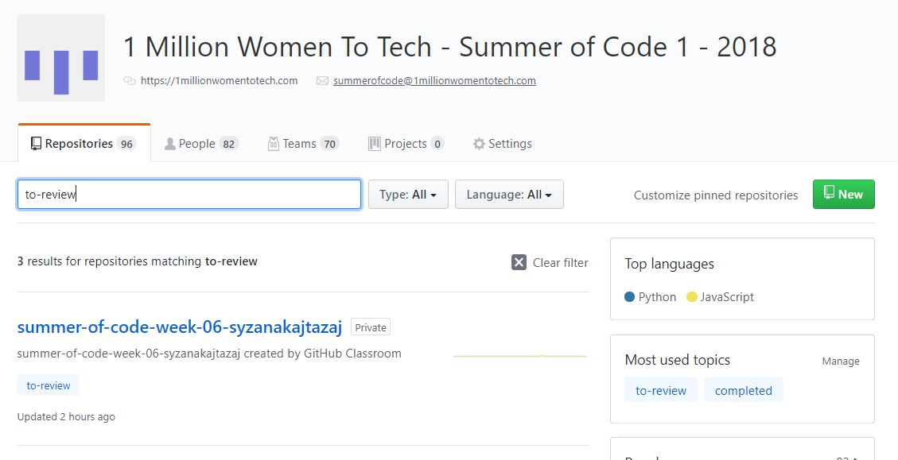
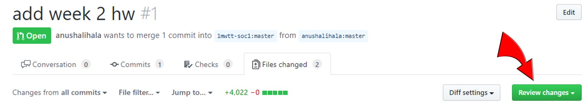
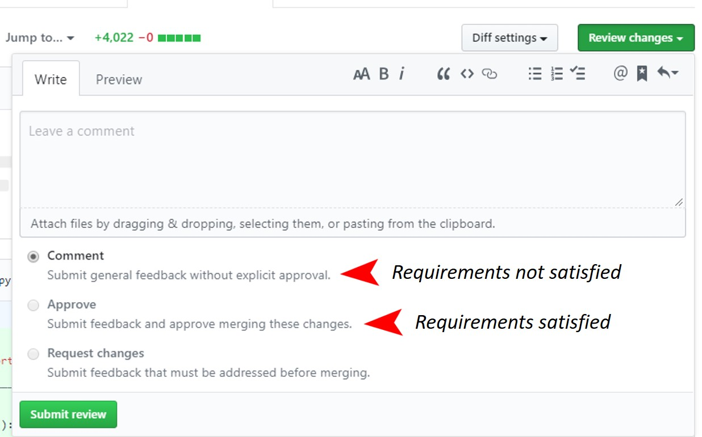

## Reviewing Assignments for SOC

- Ensure that you are a part of the 'mentors' team in the '1mwtt-soc1' organisation.

- Go to github.com/1mwtt-soc1 and search for assignments with the  'to-review' topic.

- Within the pull request, click on 'Review changes' in the 'Files changed' tab and give feedback on the code.
  - Please refer to [this video](https://www.youtube.com/watch?v=7VSaq0dPPSw) for guidance on how to submit a pull request review.
  - Please refer to [this document](https://github.com/1millionwomentotech/toolkitten/blob/master/howto/code-review.md) for our guidelines on how to give a code review.
  

- If the learner has satisfied all the requirements of the assignment, please; 
  - 'APPROVE' the changes.
- If the learner has not satisfied all the requirements of the assignment (for example if a Question is unanswered or not answered to the required degree of quality) and further changes are required for completion, please; 
  - 'COMMENT' on the changes.
  - Close the pull request. (The learner will submit the required changes via a new pull request)

Thank you!

